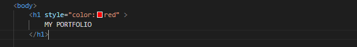
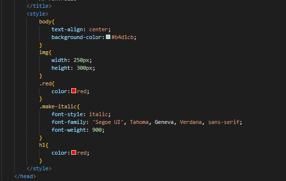
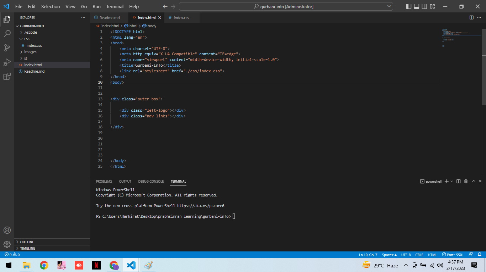
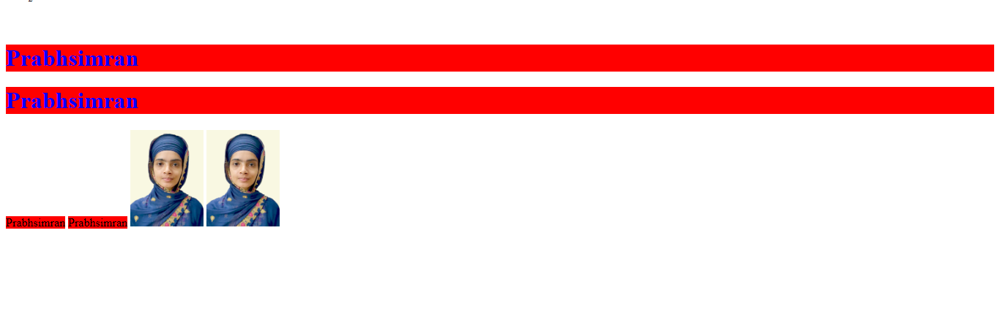

# Basic Syntax of html
- Following is the syntax of html
.png) 

# Types of CSS
- Inline -> CSS which is written within the tag using style attribute.

- Internal CSS --> CSS which is written inside the head tag.

External CSS --> CSS which is written outside the html page and linked with html using link tag.
.

- Priority of CSS
- Inline> Internal> External

# Classes 
 - Used to Diffrentiate between same tags and has great benefits as follows:-
 -  Code Reusabilty
 - Change in specific tag of similar nature.

# Concept of Inline and Block Elements

- Inline tags : Those tags which takes only the space which is required.
- Block tags : Those elements which occupies whole space even they require a character space.

- Inline Tags : img , span , b.
- Block Tags:  div , h1 , p .

